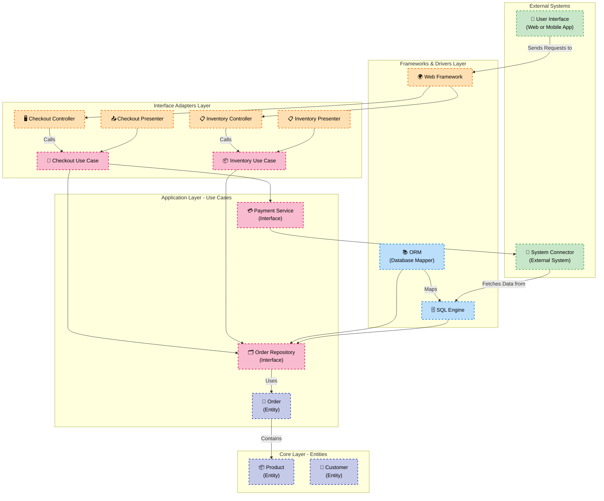

# Clean Architecture

Este sistema segue os princípios da **Clean Architecture**, separando as responsabilidades em camadas independentes. Esta arquitetura visa manter a lógica de negócios isolada de interfaces e infraestrutura, facilitando a manutenção e escalabilidade. Abaixo está uma explicação detalhada de cada camada e suas interações.

---

## 1. Camada de Sistemas Externos
- **Interface do Usuário** (`📱`): Representa a interface gráfica da aplicação, seja web ou mobile, que envia requisições para os controladores na camada de **Frameworks & Drivers**.
- **Conector de Sistema** (`🔗`): Um sistema externo que interage com o banco de dados ou outros serviços da aplicação, como APIs externas.

**Interações**:
- A **Interface do Usuário** envia requisições diretamente para o **Web Framework** na camada de **Frameworks & Drivers**.
- O **Conector de Sistema** acessa dados por meio do **SQL Engine**.

---

## 2. Camada de Frameworks e Drivers
- **Web Framework** (`🌍`): Framework que gerencia requisições HTTP, processando as solicitações da **Interface do Usuário** e repassando-as aos controladores da camada de **Adaptadores de Interface**.
- **ORM (Object-Relational Mapper)** (`📚`): Mapeia as entidades da camada de **Entidades** para o banco de dados relacional.
- **SQL Engine** (`🗄️`): Banco de dados SQL que armazena as informações da aplicação, como pedidos e produtos.

**Interações**:
- O **Web Framework** envia as requisições para os controladores da camada de **Adaptadores de Interface**.
- O **ORM** se comunica com o **Repositório de Pedidos** e o **SQL Engine** para persistir os dados.

---

## 3. Camada de Adaptadores de Interface
- **Checkout Controller** (`🖥️`): Controlador responsável pelo processo de checkout, recebendo requisições do **Web Framework** e chamando o **Caso de Uso de Checkout**.
- **Inventory Controller** (`📋`): Controlador que gerencia o inventário, invocando o **Caso de Uso de Inventário**.
- **Checkout Presenter** (`📤`): Apresentador que coleta e formata a saída do **Caso de Uso de Checkout** para a interface do usuário.
- **Inventory Presenter** (`📋`): Apresenta dados de inventário após a execução do **Caso de Uso de Inventário**.

**Interações**:
- Os controladores, como o **Checkout Controller**, chamam diretamente os respectivos casos de uso.
- Os apresentadores formatam os dados dos casos de uso para exibição na **Interface do Usuário**.

---

## 4. Camada de Aplicação - Casos de Uso
- **Checkout Use Case** (`🔄`): Lógica de negócio relacionada ao checkout, interagindo com o **Repositório de Pedidos** e o **Serviço de Pagamento**.
- **Inventory Use Case** (`📦`): Lógica de inventário, consultando o **Repositório de Pedidos**.
- **Order Repository** (`🗂️`): Interface que define operações de persistência das entidades de **Pedidos**.
- **Payment Service** (`💳`): Serviço responsável por processar pagamentos, frequentemente conectado a sistemas externos.

**Interações**:
- O **Checkout Use Case** e o **Inventory Use Case** utilizam o **Order Repository** para gerenciar os dados.
- O **Payment Service** é acionado pelo **Checkout Use Case** para processar pagamentos.

---

## 5. Camada Core - Entidades
- **Order** (`💼`): Representa a entidade de pedidos, que contém produtos e clientes.
- **Product** (`📦`): Entidade que descreve os produtos, com características como preço e quantidade.
- **Customer** (`👤`): Armazena dados dos clientes, como nome e endereço.

**Interações**:
- A entidade **Order** contém um ou mais **Products**.
- As entidades são manipuladas pelos casos de uso e persistidas através do **Order Repository**.

---

## Fluxo Geral de Dados
1. A **Interface do Usuário** envia uma requisição para o **Web Framework**.
2. O **Web Framework** repassa a requisição para o controlador adequado, como o **Checkout Controller**, que invoca o **Caso de Uso de Checkout**.
3. O **Caso de Uso de Checkout** acessa o **Repositório de Pedidos** para manipular dados e processar pagamentos via o **Serviço de Pagamento**.
4. O **Repositório de Pedidos** se comunica com o **ORM** para acessar o banco de dados.
5. Os apresentadores formatam a saída do caso de uso para ser exibida na **Interface do Usuário**.
6. O usuário visualiza a resposta processada pela interface.
